# SIETCH: edge memory for robot brains that lose signal

**Qdrant Edge memory for the local LLM brains of robots and drones working where the link home is scarce, or gone.** Planetary rovers, exploration robots, disaster drones, operations under denied comms.

Code Cubicle 6.0 · Problem Statement 03 (Qdrant Edge)

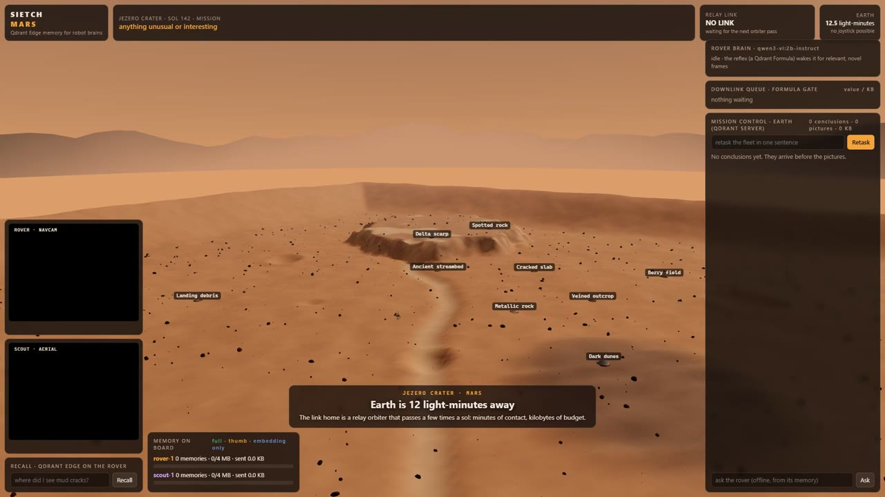

*The demo: a 3D Jezero crater. The rover and scout drone each think with their own Qdrant Edge memory; a relay orbiter's passes are the only link to mission control. Everything shown runs live on one laptop.*

## The problem

On Mars, Earth is 12 light-minutes away. The link home is a relay orbiter that passes a few times a day: **minutes of contact, kilobytes of budget.** Nobody can joystick the robot. The same holds for a drone in a collapsed building or a glider under the sea.

A robot in these places needs to:
- remember what it has seen;
- think about it on board;
- decide what is worth the scarce bytes;
- keep working when the link disappears.

That calls for a memory designed for the edge first, which is what SIETCH builds on Qdrant Edge.

## How a robot thinks

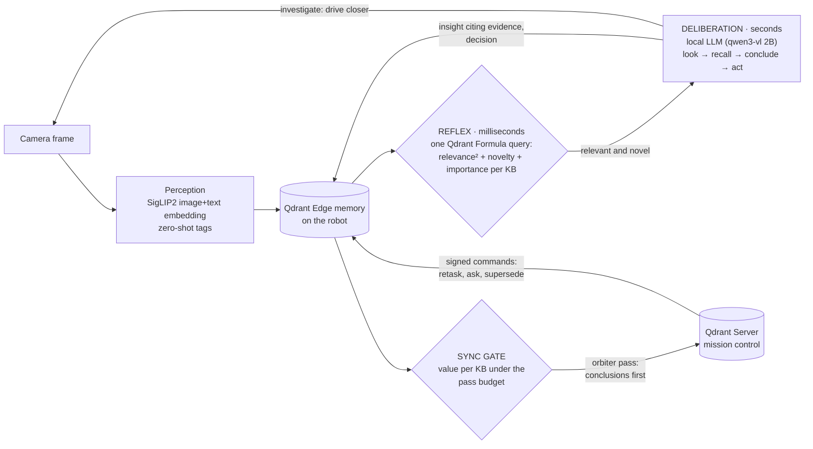

- **One memory for everything.** Camera frames, the brain's conclusions and decisions, answers and notes all live in one Qdrant Edge shard, in one image–text vector space. A sentence the brain wrote sits next to the pictures it cites.
- **Reflex and deliberation.** Every frame gets the millisecond reflex, a single Qdrant `Formula` query. The LLM wakes only when the reflex says a frame is worth thinking about.
- **Spatial memory.** Every memory is geotagged. The robot recalls by meaning *and* place ("what's within 40 m?"), using a Qdrant Edge `GeoRadius` filter, and its answers say where things are ("141 m SE").

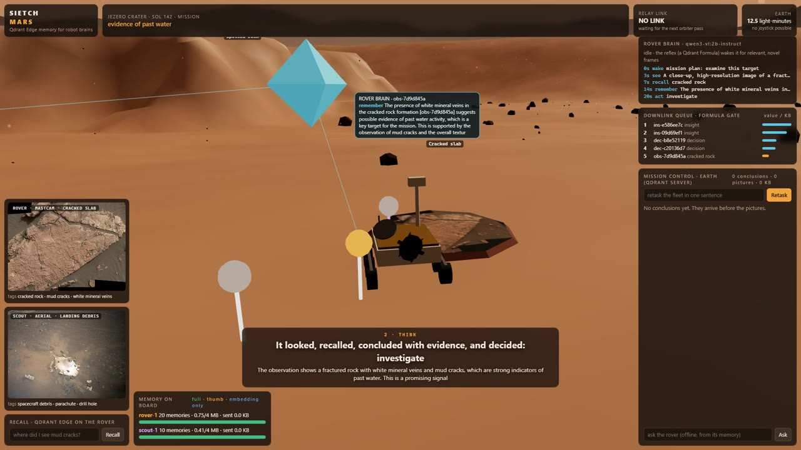

*At the cracked slab, the reflex wakes the brain. It sees the real mud-crack image (NASA PIA21261), recalls nearby memories, stores a conclusion citing its evidence (the diamond, linked to the pictures) and decides to investigate. The robot then drives closer on its own.*

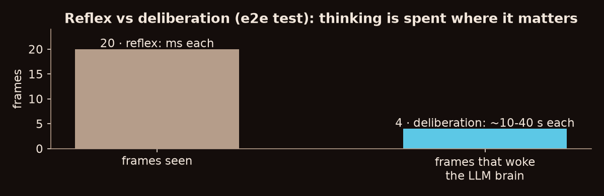

## The sync gate: meaning reaches Earth first

A conclusion is a few hundred bytes of text plus an embedding; a picture is kilobytes. The gate is one Qdrant `Formula` query per group. It ranks every unsent memory by **value per kilobyte**: mission relevance², novelty against what the fleet already delivered, how often it is recalled, and the brain's own judgement of importance. Then it fills each pass up to its byte budget.

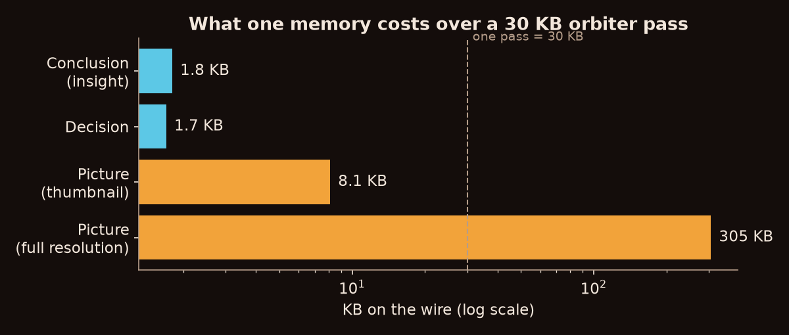

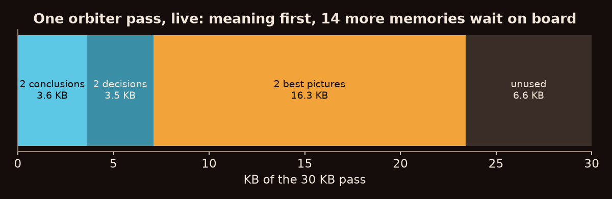

Details:
- Near-duplicates are held back. So is anything another robot already delivered to ground, at 0 bytes spent.
- Ground receives conclusions *before* their pictures, and can request the evidence later. A requested full-resolution picture streams in chunks across passes.

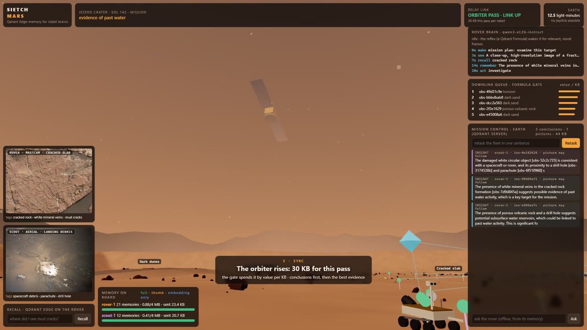

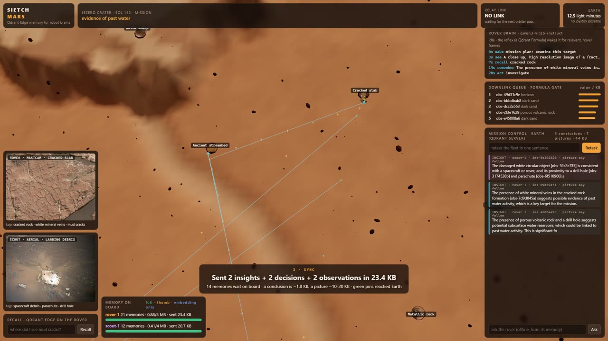

## Mission control, conflicts and trust

- **One-sentence retasking.** "Possible signs of ancient life" goes up signed on the next pass. Every robot re-ranks its whole memory on board, with no retraining.
- **Ask a robot.**
  - During a blackout, the robot answers from its own memory with citations and distances.
  - From Earth, the question goes up on one pass and the answer (a few hundred bytes) comes down on the next.
- **Evolving memory and conflicts.**
  - Hybrid logical clocks order updates.
  - Sightings of the same place from different robots merge into one site (Qdrant Server `GeoRadius`, 12 m).
  - When two robots reach opposite assessments of one place, ground opens a dispute (TypeSafe Jev). Mission control resolves it, and a signed `supersede` removes the loser from that robot's recall.
- **Signed commands.** Every command is HMAC-signed, and a spoofed "discard" is refused on board.
- **Bounded memory.** When storage fills, raw pixels tier down (full resolution → thumbnail → embedding only). The conclusions always stay.

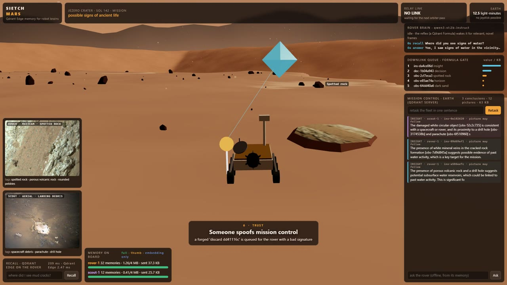

## Measured, not assumed

Every number below comes from our own runs; the sources and caveats are in [findings_results.md](findings_results.md).

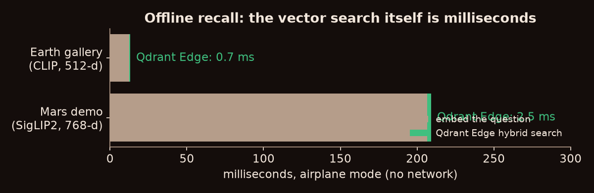

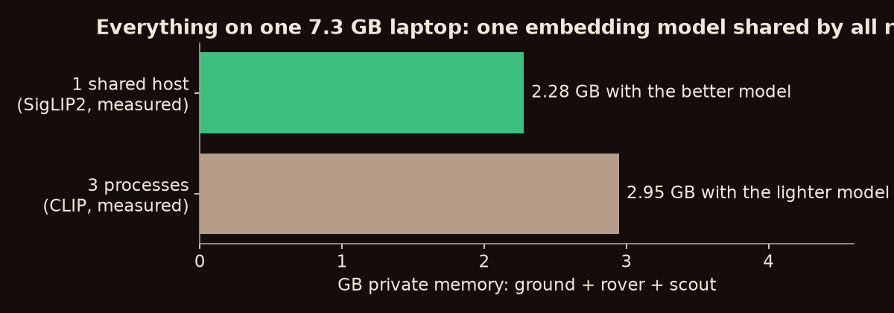

| What | Result |
|---|---|
| Unit and integration tests | 21/21 pass (`pytest tests`) |
| Sync-gate end-to-end (`tests/e2e_scenario.py`) | After a retask, what comes down is at least twice as mission-relevant as what the rovers hold; no site is paid for twice |
| Brain end-to-end (`tests/e2e_brain.py`) | 12/12, covering: the reflex wakes the brain; an insight cites evidence; the conclusion reaches ground before its picture; offline Q&A with citations; ask over the link; a dispute resolved and superseded; a forged command refused; storage tiers |
| Crash safety | Qdrant Edge 0.8.0 loses unflushed writes on a hard exit, so our SQLite write-ahead log replays them on restart (spikes 02–03) |
| Mars imagery recognition (spike 13) | SigLIP2 finds mud cracks, the meteorite, spotted rock, dunes and spacecraft debris first; fine-grained geology is harder (7/13 hit@1). The brain's captions add to recall |
| Honest limits | The 2B local LLM tends to agree with whatever mission it is given; a bigger local model is the upgrade path |

## How it maps to PS03

| PS03 goal | SIETCH |
|---|---|
| Searchable semantic memory on the device | Qdrant Edge shard per robot: observations, conclusions, decisions and answers in one image–text space, geotagged |
| Low-latency vector and hybrid search offline | Dense and BM25 search fused with RRF, plus geo filters; Qdrant Edge takes 0.7–2.5 ms, and there's no network in the loop |
| Decide what stays local vs synced | The Formula sync gate: value per KB, conclusions first, duplicates held back |
| Intermittent connectivity | Orbiter-pass windows with byte budgets, blackouts, and a crash-safe write-ahead log |
| Sync edge ↔ Qdrant Server | Point-level downlink; fleet knowledge flows back up; full resolution on demand, in chunks |
| Evolving memory, updates, conflicts | HLC ordering, geo site merging, disputes, supersede, storage tiers |
| UI for memory, search, sync status, activity | The 3D Mars sim with a HUD, the robot consoles and the ground console |
| Meaningful edge-to-cloud AI workflow | A local LLM brain that thinks with the memory; one-sentence retasking; ask-a-robot |

## Run it

Requirements:
- Python 3.12 or 3.13 (developed on Windows 11).
- The Qdrant Server binary from https://github.com/qdrant/qdrant/releases. Set `SIETCH_QDRANT_BIN`, or put it at `~/.cortex/qdrant/qdrant(.exe)`.
- For the brain: [Ollama](https://ollama.com) and `ollama pull qwen3-vl:2b-instruct` (~3.3 GB of VRAM). On 4 GB GPUs start it with `OLLAMA_CONTEXT_LENGTH=4096 ollama serve`.
- Optional, for ground's contradiction check: `TYPESAFE_API_KEY` in a git-ignored `.env`.

```bash
pip install -r requirements.txt
python run_sim.py --fresh        # Qdrant + one process hosting ground, rover-1 and scout-1
# open http://127.0.0.1:8100/sim/          free play: click to drive, shift-click to fly the scout,
#                                          keys 1-7 camera shots, C capture, P orbiter pass
# open http://127.0.0.1:8100/sim/?demo     the scripted demo (press Play)
pytest tests                     # unit/integration tests
```

Other entry points:
- `python run_fleet.py --fresh` runs one process per robot, for several laptops or for the e2e tests.
- `python -m sietch.sim.fetch_assets` refetches the NASA imagery (already in the repo).
- The demo video script and recording checklist are in [docs/demo_video.md](docs/demo_video.md).
- `python docs/make_charts.py` rebuilds these charts.

## Layout

- `sietch/node/`: the robot.
  - `perception.py`: embeddings and tags.
  - `store.py`: Edge shards and the SQLite write-ahead log.
  - `memory.py`: memory kinds, recall, the geo filter, the sync gate and tiers.
  - `brain.py`: the LLM brain.
  - `comms.py`: passes and signed commands.
  - `server.py`: the HTTP API.
- `sietch/ground/`: mission control on Qdrant Server (sites, disputes, retask, ask).
- `sietch/sim/`: the Mars simulation.
  - `host.py`: ground and both robots in one process.
  - `static/`: the three.js world, robots, memory pins, HUD and director.
  - `assets/mars/`: NASA imagery, with `CREDITS.md`.
- `spikes/`: numbered runtime validations of Qdrant Edge, the models, the gate and the brain.
- `findings_results.md`: every measurement and gotcha, with sources.

*Mars imagery: NASA/JPL-Caltech/MSSS/ASU and the Mars 2020 and MSL teams, via the NASA Image and Video Library (see `sietch/sim/static/assets/mars/CREDITS.md`). three.js is MIT-licensed.*
